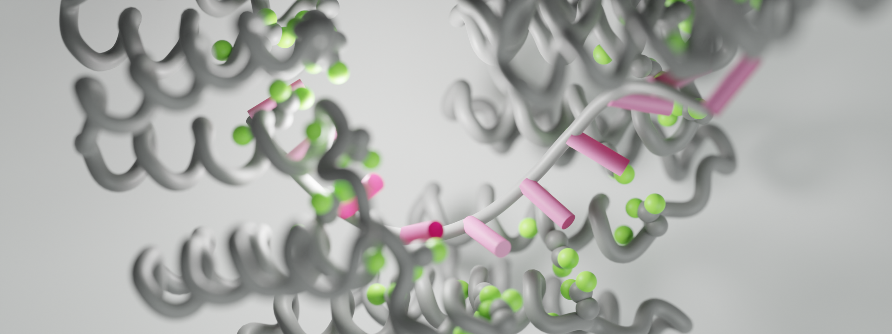
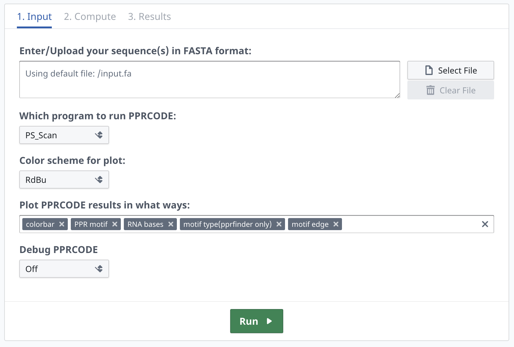

_Cover Image is presented with [**MolecularNodes Project**](https://github.com/BradyAJohnston/MolecularNodes)_

---
[](https://doi.org/10.1093/nar/gkz075)
[](http://yinlab.hzau.edu.cn/pprcode/)
[](https://colab.research.google.com/github/YaoYinYing/PPRCODE_Guideline/blob/master/PPRCODE.ipynb)
[](https://biolib.com/YaoYinYing/pprcode/)
[](https://hub.docker.com/r/yaoyinying/pprcode)
[](https://img.shields.io/badge/Build%20in-x86__64-ff69b4.svg)
----


# PPRCODE

Original Project site: [PPR Code Prediction Server - From PPR to RNA](http://yinlab.hzau.edu.cn/pprcode/)

## NOTE
This original website is Down.

Please switch to:
 1. Colab release
 2. Docker release
 3. Biolib release
 

## Three ways to run PPRCODE

 1. [WebServer from BioLib](https://biolib.com/YaoYinYing/pprcode/); 
 **the [original webserver](http://yinlab.hzau.edu.cn/pprcode/) provided by [Yin Lab](http://yinlab.hzau.edu.cn/) is down and will be no longer maintained.**
 2. [Colab Reimplementation](https://colab.research.google.com/github/YaoYinYing/PPRCODE_Guideline/blob/master/PPRCODE.ipynb)
 3. Local run: Docker image or BioLib cloud scripts
 
## Run PPRCODE locally via APIs provided by BioLib
 1. install required BioLib package
    ```shell
    pip3 install -U pybiolib
    ```
 2. run the PPRCODE via Shell commands
    ```shell
    # read the help message
    biolib run YaoYinYing/pprcode --help
 
    # fetch an example dataset 
    wget -qnc https://raw.githubusercontent.com/YaoYinYing/PPRCODE_Guideline/master/ppr_example.fasta 
    biolib run YaoYinYing/pprcode --fasta ppr_example.fasta
    ```
  **the run results will be located at $PWD/biolib_results**
  
**PS**: 
  _Due to the I/O issue of Biolib as a docker container wrapper, the customized `--save_dir` option will produce no results._
 
## Run PPRCODE locally in docker
 1. Install docker daemon by following the [official getting-started page](https://www.docker.com/get-started/) instruction.
 2. Clone this repo
    ```shell
    git clone https://github.com/YaoYinYing/PPRCODE_Guideline
    ```
 3. PPRCODE docker image.

    **fetch the latest image**
    ```shell
    docker pull yaoyinying/pprcode:latest
    ```
    **You may also build it from scratch:**
    ```shell
    cd PPRCODE_Guideline
    docker build -f docker/Dockerfile -t pprcode . 
    ```
 4. Create Conda environment for run this docker image in an instance container
    ```shell
    conda create -y -n pprcode python pip
    conda activate pprcode
    cd <repo>/PPRCODE_Guideline
    pip install -r docker/requirements.txt
    ```
 5. Run `run_docker.py` to an example data
    ```shell
    conda activate pprcode
    mkdir test
    
    # fetch an example dataset 
    wget -qnc https://raw.githubusercontent.com/YaoYinYing/PPRCODE_Guideline/master/ppr_example.fasta -P test
    
    # use PS_Scan as default program
    python /repo/PPRCODE_Guideline/docker/run_docker.py --fasta test/PPR_example.fasta --save_dir ./save-1  --plot_item=bar,score,edge,ppr,rna
    
    # or use pprfinder provided by Small's Lab
    python  /repo/PPRCODE_Guideline/docker/run_docker.py --fasta test/PPR_example.fasta --save_dir ./save-2 --plot_item=bar,score,edge,ppr,rna --program=pprfinder
    ```
 6. Advance options
    ```shell
    python  /repo/PPRCODE_Guideline/docker/run_docker.py --help
    Docker launch script for PPRCODE docker image.
    flags:
    
    /repo/PPRCODE_Guideline/docker/run_docker.py:
      --bin_dir: Where additional required binaries locate.
        (default: '/app/bin/')
      --[no]debug: debug messages
        (default: 'false')
      --docker_image_name: Name of the PPRCODE Docker image.
        (default: 'pprcode')
      --docker_user: UID:GID with which to run the Docker container. The output directories will be owned by this user:group. By default, this is the current user. Valid options are: uid or uid:gid, non-numeric values
        are not recognised by Docker unless that user has been created within the container.
        (default: '1005:50')
      --fasta: input FASTA file(s) for scan.
      --[no]fix_gap: Fix gap in sequence scanning results. Turn it off so that the results will not be weird.
        (default: 'false')
      --plot_color_scheme: <Accent|Accent_r|Blues|Blues_r|BrBG|BrBG_r|BuGn|BuGn_r|BuPu|BuPu_r|CMRmap|CMRmap_r|Dark2|Dark2_r|GnBu|GnBu_r|Greens|Greens_r|Greys|Greys_r|OrRd|OrRd_r|Oranges|Oranges_r|PRGn|PRGn_r|Paired|Pai
        red_r|Pastel1|Pastel1_r|Pastel2|Pastel2_r|PiYG|PiYG_r|PuBu|PuBuGn|PuBuGn_r|PuBu_r|PuOr|PuOr_r|PuRd|PuRd_r|Purples|Purples_r|RdBu|RdBu_r|RdGy|RdGy_r|RdPu|RdPu_r|RdYlBu|RdYlBu_r|RdYlGn|RdYlGn_r|Reds|Reds_r|Set1|S
        et1_r|Set2|Set2_r|Set3|Set3_r|Spectral|Spectral_r|Wistia|Wistia_r|YlGn|YlGnBu|YlGnBu_r|YlGn_r|YlOrBr|YlOrBr_r|YlOrRd|YlOrRd_r|afmhot|afmhot_r|autumn|autumn_r|binary|binary_r|bone|bone_r|brg|brg_r|bwr|bwr_r|civi
        dis|cividis_r|cool|cool_r|coolwarm|coolwarm_r|copper|copper_r|cubehelix|cubehelix_r|flag|flag_r|gist_earth|gist_earth_r|gist_gray|gist_gray_r|gist_heat|gist_heat_r|gist_ncar|gist_ncar_r|gist_rainbow|gist_rainbo
        w_r|gist_stern|gist_stern_r|gist_yarg|gist_yarg_r|gnuplot|gnuplot2|gnuplot2_r|gnuplot_r|gray|gray_r|hot|hot_r|hsv|hsv_r|inferno|inferno_r|jet|jet_r|magma|magma_r|nipy_spectral|nipy_spectral_r|ocean>: Color
        scheme for plot
        (default: 'RdBu')
      --plot_item: plot PPRCODE results in what ways.
        (default: 'bar,ppr,rna,type,edge')
        (a comma separated list)
      --profile_dir: Where additional required profiles locate.
        (default: '/app/profiles/')
      --program: <ps_scan|pprfinder>: Choose a proper algorithm to process your sequence. PPRCODE use PS_Scan(ps_scan) by default. However, you may use PPRfinder(pprfinder) from Small's Lab
        (default: 'ps_scan')
      --[no]report: Generate a human-friendly report file in xlsx format
        (default: 'true')
      --[no]run_benchmark: Fetch a benchmark dataset. **This could make your job running messy.**
        (default: 'false')
      --save_dir: Path to save run results.
        (default: './results')
    
    ```


## FAQs

### _Q_: What is PPR and PPR code?
Pentatricopeptide repeat (PPR) proteins constitute a large family whose members serve as single-stranded RNA (ssRNA)-binding proteins; these proteins are particularly abundant in terrestrial plants, as more than 400 members have been identified in Arabidopsis and rice.

PPR proteins are typically characterized by tandem degenerate repeats of a 35-amino acid motif. Within a given repeat, the combinatorial di-residues at the 5th and 35th positions are responsible for specific RNA base recognition. These di-residues are referred to as the **PPR code**. 


### _Q_: What is PPRCODE prediction server?
**PPRCODE** prediction server is aimed to provide services to the PPR community to facilitate PPR code and target RNA prediction. Once a PPR protein sequence is submitted, the server firstly identifies the PPR motifs using the PScan algorithm provided by Prosite, and then outputs the individual PPR motifs that is demarcated based on the PPR structure. PPR code is generally extracted from the 5th and 35th amino acids of each PPR motif, and the best matched RNA base for the PPR code is provided. As a result, the potential RNA target for the PPR sequence is available. 




### _Q_: How do I submit a sequence to the PPRCODE prediction server?

Go to the [PPRCODE prediction server in BioLib](https://biolib.com/YaoYinYing/pprcode/) submission form directly and do the following:
  1. Paste your FASTA sequence in the upper text area.
  2. Modify the options if needed.
  3. Click the Run button.
 After the submission, the webpage will be automatically run for several second until the job is finished. 
 
### _Q_: How long does it take to finish a task?
Less than three second for each sequence.

### _Q_: How many sequences can I submit in one submission?
As many as you want.


### _Q_: What does the prediction result mean?
The result page contains a table like the following:

> This is a demo sequence of PPR10 from *Zea mays*.


Motif Start | Motif End | Motif Sequence | Fifth amino acid | Last amino acid | PPR Code | RNA base | Motif Length | ProSite Score
 -----|-----|-----|-----|-----|----|----|----|----
138 | 172 | ASALEMVVRALGREGQHDAVCALLDETPLPPGSRL | E | L | EL | ? | 35 | 5.031
174 | 208 | VRAYTTVLHALSRAGRYERALELFAELRRQGVAPT | T | T | TT | A>G | 35 | 12.989
209 | 244 | LVTYNVVLDVYGRMGRSWPRIVALLDEMRAAGVEPD | N | D | ND | U>C>G | 36 | 11.093
245 | 279 | GFTASTVIAACCRDGLVDEAVAFFEDLKARGHAPC | S | C | SC | ? | 35 | 11.411
280 | 314 | VVTYNALLQVFGKAGNYTEALRVLGEMEQNGCQPD | N | D | ND | U>C>G | 35 | 12.737
315 | 349 | AVTYNELAGTYARAGFFEEAARCLDTMASKGLLPN | N | N | NN | C>U | 35 | 11.477
350 | 384 | AFTYNTVMTAYGNVGKVDEALALFDQMKKTGFVPN | N | N | NN | C>U | 35 | 14.096
385 | 419 | VNTYNLVLGMLGKKSRFTVMLEMLGEMSRSGCTPN | N | N | NN | C>U | 35 | 10.358
420 | 454 | RVTWNTMLAVCGKRGMEDYVTRVLEGMRSCGVELS | N | S | NS | C>U>A | 35 | 9.887
455 | 489 | RDTYNTLIAAYGRCGSRTNAFKMYNEMTSAGFTPC | N | C | NC | U>C>>A | 35 | 11.674
490 | 524 | ITTYNALLNVLSRQGDWSTAQSIVSKMRTKGFKPN | N | N | NN | C>U | 35 | 11.542
525 | 560 | EQSYSLLLQCYAKGGNVAGIAAIENEVYGSGAVFPS | S | S | SS | A | 36 | 6.467
561 | 595 | WVILRTLVIANFKCRRLDGMETAFQEVKARGYNPD | R | D | RD | - | 35 | 6.445
596 | 630 | LVIFNSMLSIYAKNGMYSKATEVFDSIKRSGLSPD | N | D | ND | U>C>G | 35 | 12.419
631 | 666 | LITYNSLMDMYAKCSESWEAEKILNQLKCSQTMKPD | N | D | ND | U>C>G | 36 | 8.67
667 | 701 | VVSYNTVINGFCKQGLVKEAQRVLSEMVADGMAPC | N | C | NC | U>C>>A | 35 | 13.778
702 | 736 | AVTYHTLVGGYSSLEMFSEAREVIGYMVQHGLKPM | H | M | HM | ? | 35 | 10.348
737 | 771 | ELTYRRVVESYCRAKRFEEARGFLSEVSETDLDFD | R | D | RD | - | 35 | 8.089


and finally you will also get a predicted sequence like this:
>(?) (A>G) (U>C>G) (?) (U>C>G) (C>U) (C>U) (C>U) (C>U>A) (U>C>>A) (C>U) (A) (-) (U>C>G) (U>C>G) (U>C>>A) (?) (-)


### _Q_: Why does the prediction result of my sequence look like a mess?
PS_Scan/PPRfinder identifies the sequence and motifs of a PPR protein by its similarity to the general P-type PPR. Sequences with low identity will hardly be predicted. In this circumstance, manual correction is strongly recommended. 

## Troubleshoot
If there is any problem and advice with the website, you are welcome to contact us via [email](mailto:yaoyy@webmail.hzau.edu.cn).

## Contributers:
* **Yinying Yao**: Main program development and further maintainance.
* **Zeyuan Guan**: Basic Framework of the original webserver.
* **Junjie Yan**: Writing and data collecting.
* **Xiang Wang**: Providing useful advices to the original webserver design.

## Cite information
Yan Junjie#, Yao Yinying#, Hong Sixing, Yang Yan, Shen Cuicui, Zhang Qunxia, Zhang Delin, Zou Tingting, Yin Ping*. Delineation of pentatricopeptide repeat codes for target RNA prediction, Nucleic Acids Research. 2019 February 11. doi: doi.org/10.1093/nar/gkz075

